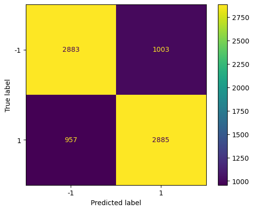
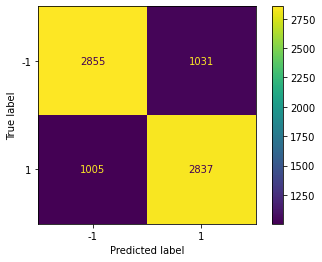

# Predicting NCAA Basketball Game Results
## ML4641 - Team 30
### Introduction
National sports, and notably college basketball, has proliferated throughout society and has garnered millions of fans throughout the world. With NCAA basketball becoming a premier form of entertainment, it becomes important to be able to predict these games for several reasons. Bunker and Thabtah [1] analyzed the proficiency of using artificial neural networks to predict outcomes of games and found the average performance of this model to be around 67.5%. Fialho et al. [2] reviewed different models such as artificial neural networks and support vector machines when applied to soccer and suggested that neural networks over the other methods due to their higher accuracy. Jain and Kaur [3] used Caret algorithm to pre-process the data and Boruta algorithm for features selection. The trained SVM then produced accuracy averaging 86%. With these studies in mind, an effective plan for developing a predictive model for NCAA basketball games can be made.
### Problem Definition
With sports betting finding immense popularity in today’s society, it becomes desirable to investigate whether machine learning techniques provide any advantages. A successful predictive model would lead to huge financial implications in a lucrative industry.
### Data Collection

The dataset we used for data collection was gathered from the College Basketball Dataset provided by Kaggle, which contained NCAA games from 2013 up until 2021. We used a Python based scraper to collect data from around 60,000 games from all 8 seasons, but to make it more efficient, we randomly selected teams in each season to collect data from. The features we are most interested in looking at are the venue the teams played at (home, away, or neutral) and the winner/loser outcome of the game. An important observation from the outcome that we want to investigate further is how a winning/loss streak can greatly impact a team’s morality and potentially their performance within the next games they play. As an additional feature, we will add the most recently played game’s outcome as part of the dataset to see its potential influence on its respective current game. For data cleaning, all rows that contained any NaN’s were removed from the dataset, and binarization techniques for feature data were used to convert home, neutral, and aways to 1, 0, and -1, and wins and losses to 1 and -1, respectively. The scraper file, implementation of binarization and data cleaning, as well as example tables of the data can be found within the GitHub and Jupyter notebook. Below shows the final cleaned dataset of features.

### Methods
To determine the outcome of a game, we will perform binary classification (win vs loss) between two teams using the input data of tempo-free team statistics. We obtained a Kaggle dataset of the tempo-free team statistics across multiple seasons. Not only are we interested in using the tempo-free statistics as features, but we are also interested in using the outcomes of a team's recently played games. We hypothesize that winning and losing streaks will have a major impact on a teams' morale and the performance for the next game. We will experiment with several different  methods:
1. Support Vector Machines: we trained an SVM to linearly separate two teams into winner and loser classes. We used sci-kit learn to implement SVM.
2. Logistic Regression: we used logistic regression by applying a binary classification of wins and losses. We validated the model using k-fold cross validation using k = 5.
3. Gaussian Naive Bayes: (25 features  -> PCA for the 11 principal components -> retains more than 95% of the variance accuracy of 62.7% ± 0.5%) 

### Results and Discussion

We chose to deviate from our initial proposal and build our prediction model using three supervised methods - Gaussian Naive Bayes, Logistic Regression, and Support Vector Machine (SVM). While Decision Tree and Neural Networks were rejected as candidate models, they may still be considered in the future to enhance the selection process for the most suitable prediction model.

Before applying the selected models to the dataset, some preprocessing in the form of Principal Component Analysis (PCA) is performed in order to reduce the dimensions of the dataset. This will reduce the computation required during training and will provide data that is easier to work with. We use PCA to reduce the dimensions of our dataset from 24 to 11 components. A visualization of this method can be seen below.
<!-- [PCA Visualization](/pca_visualization.html) -->


To evaluate our models' performance, we utilized a confusion matrix and obtained their corresponding accuracy and F-1 score values, as presented below:

| Model                          | Accuracy                | F-1 Score   |
| ------------------------------ | ----------------------- |-------------|
| Gaussian Naiver Bayes          | 62.7 ± 0.5%             | 63.6 ± 0.6% |
| Logistic Regression            | 62.7 ± 0.6%             | 63.6 ± 0.7% |
| Support Vector Machine         | 62.8 ± 0.4%             | 64.7 ± 0.5% |

Based on the data presented in the table, it is evident that all three models have produced comparable accuracy and F-1 scores, which indicates satisfactory performance for our specific use case. However, it should be noted that the efficacy of each model cannot be generalized, as they have their unique strengths and limitations. For instance, we have observed that Gaussian Naive Bayes and Logistic Regression are computationally efficient and straightforward to implement. On the other hand, Support Vector Machines are the most suitable option for handling non-linearly separable datasets. However, SVMs are computationally expensive and comparatively more complex than the other two models.

Models:\
Gaussian Naive Bayes\
Using the Gaussian Naive Bayes approach, we achieved an accuracy rate of 62.7 ± 0.5% and an F1 score of 0.636 ± 0.7%. Despite the relatively low values for both metrics, it is noteworthy that the similarity between them indicates that the model is not exhibiting hardly any bias and is performing consistently across all selected features.

Logistic Regression\
For our logistic regression model, we saw an accuracy of 62.7 ± 0.6% when predicting the outcome of randomly sampled games. Additionally, the model showed an F1 value of 63.6 ± 0.7%.

Support Vector Machines\
As for SVM, our model has an accuracy of 62.8 ± 0.4% and an F1 score of 64.7 ± 0.5%.

While the team saw an accuracy of around 63%, several improvements can be made for the final report. Currently, the parameters of these models are not tuned meaning improvements can be seen once this is incorporated. Additionally, finding and eliminating additional bias may be possible after identifying other features to consider. Thus, for the final report, the team will look into improving these models and potentially exploring new ones.

### Proposed Timeline
[Link to Gantt Chart](https://www.dropbox.com/s/cof5fgvn9mwrexg/GanttChart.xlsx?dl=0)

[View in Repo](GanttChart.xlsx)
TODO: update contribution table\
### Contribution Table

| Contributor                    | Task                                                                     |
|--------------------------------|--------------------------------------------------------------------------|
| Alvin Fabrio                   | Managed team logistics, created Gantt chart, and assisted members in performing their tasks. Prepared the presentation and one of the members that performed it. Contributed to the midterm report by writing the results and discussions after analyzing the outputs of the 3 models.                |
| Phillip Kim                    | Wrote the introduction/background and problem definition. Researched articles to provide details about the background of the NCAA and statistics of already existing predictive models for the sport. Contributed to the midterm report by writing the results/discussions and generating the confusion matrices.                               |
| Jerred Chen                    | Provided the techniques to train our model and methods for data classification. Also went in depth about the details of the potential results, discussing how we will be able to measure the accuracy of our model. Contributed to the midterm report by writing the jupyter notebook to train the 3 different models.                 |
| Jun Yi Chuah                   | Researched many of the articles used in the background and problem definition. Also assisted with writing the potential results and discussion with the researched articles. Contributed to the midterm report by creating the PCA visualization and embedding it in the report. Also helped write portions of the results/discussion.                                              |
| Alexa Hanna                    | Created the contribution table and powerpoint presentation. Filled in each member’s contribution within the table and also filled in most of the information within the presentation. Also one of the presenters for the proposal video. Contributed to the midterm report by assisting with data collection and writing the data collection section.

### References
[1] R. P. Bunker and F. Thabtah, “A machine learning framework for sport result prediction,” Applied Computing and Informatics, vol. 15, no. 1, pp. 27–33, Jan. 2019, doi: https://doi.org/10.1016/j.aci.2017.09.005.

[2] G. Fialho, A. Manhães, and J. P. Teixeira, “Predicting sports results with Artificial Intelligence – A proposal framework for soccer games,” Procedia Computer Science, vol. 164, pp. 131–136, 2019. 

[3] S. Jain and H. Kaur, "Machine learning approaches to predict basketball game outcome," 2017 3rd International Conference on Advances in Computing,Communication & Automation (ICACCA) (Fall), Dehradun, India, 2017, pp. 1-7, doi: 10.1109/ICACCAF.2017.8344688.
